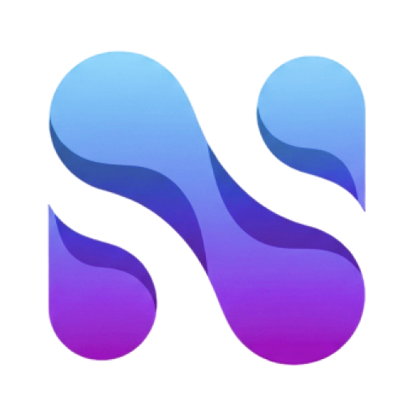

# Neuro.Helper

<div align="center">
  
  <p><strong>An intelligent navigator in the world of neural networks</strong></p>
  <p>Save up to 40% of your time searching for suitable AI tools</p>
</div>

---

## Table of Contents

## Table of Contents

- [About the product](#about-the-product)
  - [Key features](#key-features)
- [Technology stack](#technology-stack)
- [Installation and launch](#installation-and-launch)
  - [System requirements](#system-requirements)
  - [Step 1. Installing Ollama and the language model](#step-1-installing-ollama-and-the-language-model)
  - [Step 2. Setting up and launching the backend](#step-2-setting-up-and-launching-the-backend)
  - [Step 3. Setting up and launching the frontend](#step-3-setting-up-and-launching-the-frontend)
  - [Step 4. Access to the application](#step-4-access-to-the-application)
- [Google OAuth Configuration](#google-oauth-configuration)
- [Product Architecture](#product-architecture)
  - [Backend (FastAPI)](#backend-fastapi)
  - [Frontend (React + Vite)](#frontend-react--vite)
  - [Component interaction](#component-interaction)
  - [Database](#database)
  - [Security](#security)
  - [Scalability](#scalability)
- [Development plans](#development-plans)
- [Authors](#authors)

---

## About the product

**Neuro.Helper** is a recommendation platform for quickly selecting neural network services for specific business tasks. The system analyzes the text description of the task, extracts key parameters, and offers optimal solutions based on budget, complexity, and API availability.

### Key features

- **Semantic search** — describe the task in natural language, the algorithm will determine the relevant tags by itself
- **Flexible filtering** — filters based on price, complexity, API availability and type of tasks to be solved
- **Interactive assistant** — clarifying questions for the most accurate selection
- **Personal Collections** — save neural networks to favorites for quick access
- **Query history** — all search sessions are saved with the possibility of reuse
- **Usage Analytics** — Track activity, popular filters and statistics
- **Temization** — light and dark design themes
- **OAuth 2.0** — secure authorization via Google

---

## Technology stack

**Frontend**
React 18, Vite, React Router DOM, Feather Icons, CSS Modules

**Backend**
FastAPI, SQLAlchemy, SQLite, Authlib (Google OAuth), Ollama API

**Infrastructure**
Uvicorn, Python 3.10+, Node.js 18+

---

## Installation and launch

### System requirements

- Python 3.10 or higher
- Node.js 18 or higher
- Ollama with the installed llama3.2:3b model

### Step 1. Installing Ollama and the language model

Download and install Ollama from the official website, then run:

```bash
ollama pull llama3.2:3b
```

### Step 2. Setting up and launching the backend

```bash
cd backend
pip install -r requirements.txt
python run.py
```

The API server will start on port 8080.

### Step 3. Setting up and launching the frontend

```bash
cd frontend
npm install
npm run dev -- --host
```

The web interface will be available on port 5173.

### Step 4. Access to the application

After launching both servers, the application is available at the following addresses:

**Local access (development)**
`
http://localhost:5173
`

**Access from other devices on the local network**

For testing from mobile devices or other computers on the same network:

1. Turn on the mobile hotspot mode on the device where the server is running
2. Connect the target device to the created Wi-Fi network
3. Open a browser and navigate to: `http://192.168.137.1.nip.io:5173 `


Service 'nip.io' automatically resolves the IP address to the domain name, which is necessary for Google OAuth to work correctly from external devices.

> **Note:** If your server's IP address differs from the specified one, replace `192.168.137.1` with the current address. You can find it with the command `ipconfig` (Windows) or `ifconfig` (Linux/Mac).

---

## Google OAuth Configuration

For authorization to work, you need to create a project in the Google Cloud Console and configure OAuth 2.0.

1. Go to **APIs & Services → Credentials**
2. Create an **OAuth 2.0 Client ID**
3. In the **Authorized redirect URIs** field, add:
- `http://localhost:8080/auth/google/callback `
- `http://192.168.137.1.nip.io:8080/auth/google/callback`
4. Copy **Client ID** and **Client Secret** to the `.env` file of the backend:

```env
VITE_GOOGLE_CLIENT_ID=your_client_id_here
VITE_GOOGLE_CLIENT_SECRET=your_client_secret_here
```

After making the changes, restart the backend server.

---

## Product Architecture

**Neuro.Helper** is based on a classic client-server architecture, divided into independent frontend and backend components that interact via the REST API.

### Backend (FastAPI)

The server part is implemented on the asynchronous FastAPI framework, which provides high performance and automatic generation of OpenAPI documentation.

**Backend structure:**

- `app/main.py ` — application entry point, CORS and middleware configuration
- `app/routers/` — API endpoint handlers
    - `auth.py ` — authentication via Google OAuth 2.0, issuing JWT tokens
    - `neural_nets.py ` — search and filtering of neural networks by tags
    - `chats.py ` — saving and retrieving query history
    - `favorites.py ` — management of selected neural networks
    - `ollama.py ` — integration with the local LLM for tag extraction
- `app/database/` — SQLAlchemy models and database sessions
- `app/services/` — business logic, including JWT creation and validation

**Key backend technologies:**

- FastAPI — web framework
- SQLAlchemy — ORM for working with SQLite
- Authlib — OAuth 2.0 client for Google
- PyJWT — generation and verification of JWT tokens
- Uvicorn — ASGI server

### Frontend (React + Vite)

The client part is a single-page application with dynamic rendering and client routing.

**Frontend structure:**

- `src/pages/` — application pages
    - `MainPage` — main screen with search bar and mode switching
    - `ProfilePage` — personal account with usage analysis
    - `FavoritesPage` — saved neural networks 
    - `HistoryPage` — query history with pagination
- `src/components/` — reusable UI components
    - `NeuralCards` - neural network cards with information about price, complexity and API
    - `FilterChips` — display of selected filters
    - `Sidebar` — side navigation menu
- `src/services/` — API interaction layer
    - `api.js ` — client for HTTP requests with automatic JWT substitution
- `src/context/` — React-context for theme management
- `src/styles/` — global styles and CSS variables

**Key technologies of the frontend:**

- React 18 — UI library
- Vite — build tool and dev server
- React Router DOM — routing
- Feather Icons — interface icons
- CSS variables — dynamic theming

### Component interaction

1. The user enters a text query or selects filters on the frontend
2. The request is sent to the backend via the REST API with the JWT token in the header
3. If necessary, the backend accesses the Ollama API to extract semantic tags from the text.
4. The backend performs a search through the neural network database, taking into account the weights of the tags and the selected filters.
5. The results are returned to the frontend and displayed as flashcards.
6. The user can save the neural network to favorites — the request goes to the appropriate endpoint.
7. Each successful search is saved in the chat history for later access

### Database

SQLite is used with the SQLAlchemy ORM. Basic entities:

- **User** — users logged in via Google
- **NeuralNet** — catalog of neural networks with tags, price category, complexity
- **Chat** — history of search queries linked to the user
- **Favorite** — user's favorites neural networks

### Security

- Authentication via Google OAuth 2.0 with token verification
- JWT tokens with a limited lifetime for API access
- CORS policies with a limited list of allowed sources
- Environment variables for storing sensitive data

### Scalability

The architecture provides for horizontal scaling:

- The backend does not store the session status — it is possible to run multiple instances behind the load balancer
- SQLite can be replaced with PostgreSQL without changing the codebase
- The frontend is assembled into static files and can be distributed via CDN

---

## Development plans

- Integration with a public API for third-party developers
- Building neural network chains to solve complex problems
- Expanding the knowledge base to several thousand models
- Implementation of a system of ratings and user reviews
- Localization into English and entry into the international market

---

## Authors

**NeuroHelper** is created and maintained by the **NeuroTech™** team.

For questions, collaboration inquiries, or support, please open an issue in this repository.

---

<div align="center">
  <p>Made with ❤️ by <strong>NeuroTech™</strong></p>
</div>